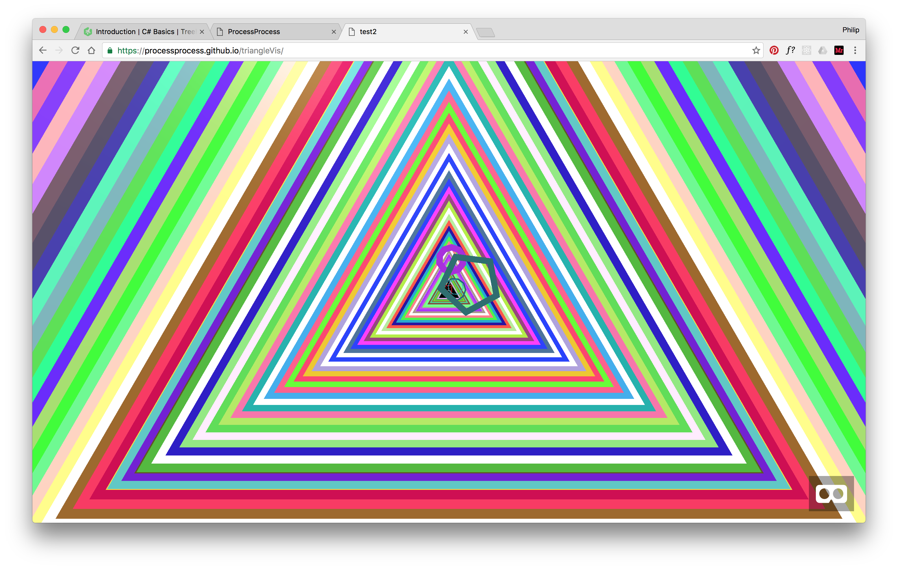
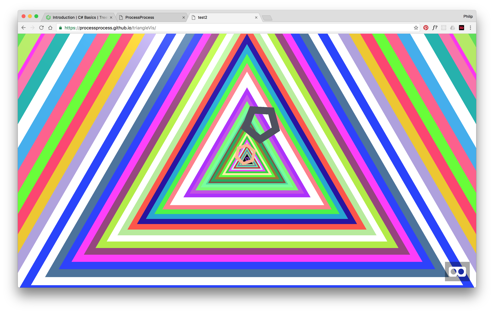
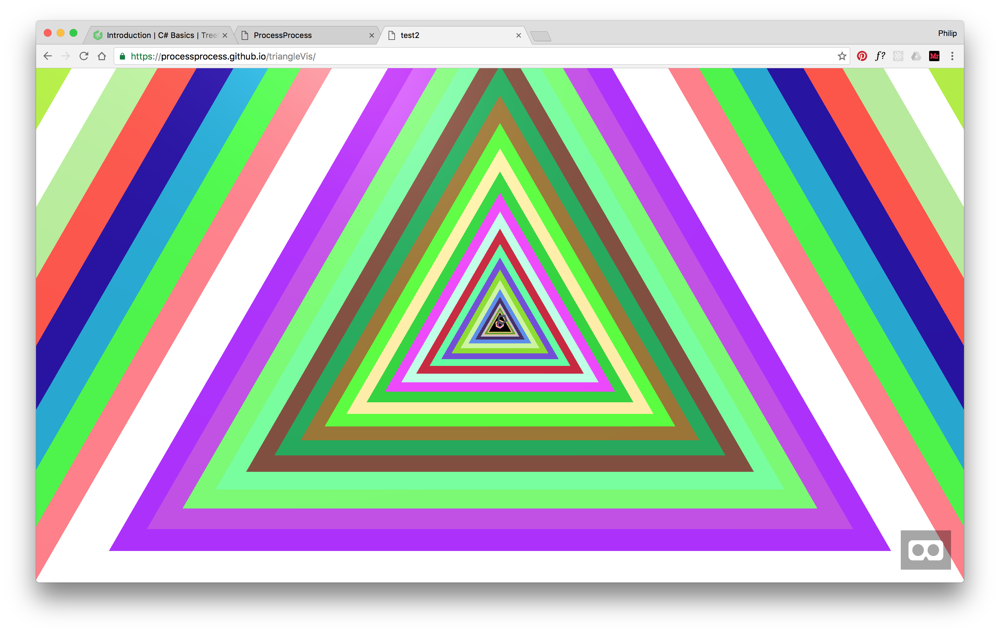

# triangleVis
# [LIVE DEMO](https://processprocess.github.io/triangleVis/)

Spiking into web VR with A-Frame to search for the future of interaction and interface.

## FUTURE
- generate entities through JS for easy DOM manipulation
- add interaction with gaze control
- navigate scenes with gaze control

